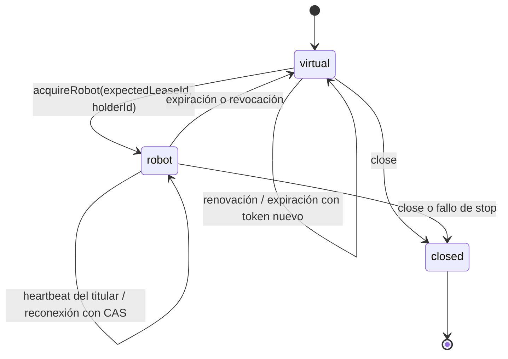

# Lease y coordinador de embodiment

`@mimix/embodiment-contract` define leases y estados versionados con Zod. El módulo
`apps/api/src/modules/embodiments` decide quién puede emitir dentro de una conversación.
No depende de Agent Core, personaje ni proveedor de voz.

## Máquina de estados

Un lease contiene `conversationId`, `leaseId`, `holderId`, `kind`, `revision` y
`expiresAt`. UUIDs se normalizan; no admite campos físicos ni credenciales.
`virtual` exige lease web y `webMuted=false`; `robot` exige lease robot y
`webMuted=true`; `closed` carece de lease y permanece silenciado.

## Autoridad e invariantes

- Un coordinador mantiene exactamente un lease vigente, o ninguno cuando cierra.
- Las mutaciones son síncronas, sin `await`: dos adquisiciones con el mismo
  `expectedLeaseId` tienen como máximo un ganador. La segunda ve token obsoleto.
- Toda sustitución crea UUID nuevo y aumenta revisión. AbortSignal invalida
  permisos anteriores antes de permitir otra salida. Reentradas durante esa
  notificación no obtienen permisos ni cambian el titular.
- Heartbeat exige token y titular actuales. Se acepta solo antes del vencimiento;
  en el instante de expiración ya no puede resucitar el lease. Renueva el plazo,
  sin cambiar token/revisión ni interrumpir salida.
- Una síntesis o reproducción web activa retiene su lease virtual. Si vence mientras
  sigue retenido, el coordinador amplía su plazo sin abortar la salida; al liberar
  la última retención, la próxima expiración vuelve a rotar token y revisión.
  La retención nunca impide una cesión explícita a robot.
- El temporizador provoca fallback incluso sin peticiones; toda lectura o uso
  vuelve a comprobar expiración para cubrir temporizadores demorados. Timers viejos
  no invalidan un heartbeat nuevo. Producción usa un reloj monotónico del proceso
  anclado a época; el cliente no debe decidir autoridad comparando su reloj local.
- Revocación exige token actual y vuelve a virtual; cierre es idempotente y terminal.
- Snapshots son copias. Modificarlos no cambia la autoridad.

TTL predeterminado: 15 segundos; configuración interna 100–60000 ms. No es un token
de seguridad distribuido. `acquireRobot` y `revoke` son operaciones internas para un
llamador **ya autorizado**. No hay rutas HTTP que permitan adquirir robot, ni se
reutiliza el token legacy del puente como autorización. DeviceSession/pairing y
transporte de estado quedan para sus fases.

## WebEmbodiment y RobotEmbodiment

`WebEmbodiment.permit()` obtiene un permiso web revocable. `present(permit, id, play)`
comprueba autoridad justo antes de invocar el callback síncrono de reproducción.
Requiere un puerto `stop()`; al perder lease o cerrar el adaptador, lo invoca.
Mientras la reproducción está activa retiene el lease virtual y libera esa retención
al detener, reemplazar o cerrar la salida. El driver debe llamar
`complete(utteranceId)` cuando el clip termina naturalmente; un callback tardío de
un clip reemplazado no puede liberar la reproducción actual.
Un fallo de `stop()` cierra la autoridad y rechaza cesión a robot. Esto es una
protección lógica: no puede garantizar silencio de un dispositivo cuyo driver falla.

`play` debe entregar directamente a un driver cancelable; no debe crear tareas
independientes que eludan el permiso. Cada nueva salida del adaptador detiene la
anterior. El mismo coordinador consume como máximo una entrega por utterance, incluso
si cambia de titular, se reconecta o falla la salida. Conserva solo hasta 256 UUIDs;
al llegar al límite rechaza otras entregas hasta crear una conversación nueva. No
borra IDs para permitir replays. `RobotEmbodiment.perform()` solo devuelve `stub` o
`suppressed`, consume la misma reserva y nunca emite audio, red ni movimiento.

No es un adaptador DOM ni una integración con el mundo Three.js. El puerto de salida
queda listo para la fase frontend; todavía no existe transporte para replicar estos
permisos a un navegador o robot remoto.

## Integración de voz y aislamiento

`VoiceService` posee un `EmbodimentSessions` por instancia; Nest y Express usan el
mismo servicio de voz que antes. Un llamador interno confiable puede compartir ese
registro mediante el cuarto parámetro del constructor o `voice.embodiments`.

La API de voz existente no tiene conversaciones explícitas: se conserva una
conversación implícita por UUID **verificado** del usuario, que también es el titular
virtual. No acepta un conversationId, holder ni lease proporcionados por el cuerpo
HTTP. Cada usuario tiene autoridad independiente.

Antes de reservar cuotas y llamar a ElevenLabs, la síntesis obtiene permiso web
(renovando y reteniendo el lease virtual hasta terminar). Con lease robot retorna `text_only/EMBODIMENT_MUTED`
y subtítulo exacto, sin consumir cuota de generación. Una transferencia, expiración
o revocación aborta la síntesis pendiente y su resultado tardío nunca devuelve
audio, aunque se haya vuelto a virtual. Cancelación/timeout/cuotas mantienen los
motivos anteriores; proveedor deshabilitado sigue devolviendo `DISABLED`.

La respuesta HTTP continúa siendo MP3 acotado en base64, no reproducción. Generar
no consume una entrega de `present`: reintentos de síntesis siguen pudiendo generar
costo, como en el contrato anterior. Los adaptadores impiden replay **de entrega**;
el endpoint no ofrece idempotencia de facturación.

Un cliente antiguo que ya descargó audio puede reproducirlo después de un cambio de
lease. Este PR evita nuevas respuestas de audio y cancela trabajo pendiente, pero
no promete detener ese playback remoto sin un cliente y transporte que observen
permisos. Tampoco coordina múltiples pestañas de ese cliente antiguo.

## Recursos, persistencia y despliegue

El registro limita a 1000 conversaciones. En cada acceso elimina virtuales con al
menos 5 minutos sin uso; no expulsa un robot con lease vigente. Los temporizadores
por conversación son acotados y no retienen el proceso al apagar; `close()` cancela
todos. Cuando se agota capacidad, voz responde `BUSY` sin llamar al proveedor.
Se guardan UUIDs/estados/plazos en memoria, nunca texto ni audio. No se añaden logs
con identidad ni historial durable de leases; esa auditoría deberá definirse junto
con DeviceSession antes de activar dispositivos.

Solo hay autoridad dentro de **un proceso y una instancia compartida de registro**.
No usar réplicas independientes para una misma conversación con robot habilitado.
Reiniciar invalida todos los permisos locales; una integración futura debe exigir
nueva autorización y detenerse al perder heartbeat. No hay cambios SQL, MQTT,
LiveKit, seguridad física, promesas offline ni integración de hardware.

Ver [operación y evidencia](../runbooks/embodiment-coordinator.md).
