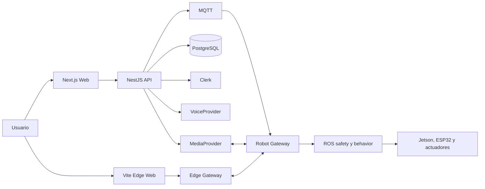

# Arquitectura objetivo de Mimix

## Decisión ejecutiva

Mimix evolucionará dentro de este repositorio hacia un monorepo TypeScript administrado con pnpm y Turborepo. La plataforma cloud usará Next.js con App Router para la experiencia de producto y NestJS sobre Fastify para la API. El mundo 3D, el runtime de retos y el modo local del robot conservarán una frontera cliente explícita; Vite seguirá siendo el compilador de la aplicación local y de los artefactos aislados que no necesitan servidor Next.js.

Next.js no reemplazará el backend de dominio. Sus Route Handlers y Server Actions se limitarán a necesidades propias de la interfaz. Autenticación, progreso, campañas, agente, dispositivos y sincronización pertenecerán a `apps/api`.



## Motivo de la arquitectura híbrida

Next.js aporta rutas, layouts, carga progresiva, páginas públicas, paneles y una integración madura con Clerk. También permite despliegue autónomo en Node.js o Docker. Sin embargo, un export estático pierde las funciones de servidor; por eso no debe ser la única base del modo offline.

Vite ya compila correctamente el mundo Three.js actual y produce activos estáticos simples de servir en una Jetson. Mantener Vite para el runtime local reduce el riesgo de migración y evita convertir la disponibilidad de Next.js en requisito para usar el robot sin Internet.

Turbopack es el bundler de Next.js. Turborepo es el orquestador del monorepo. No cumplen la misma función:

- `pnpm`: instalación, workspaces y resolución de paquetes.
- `turbo`: ejecución, caché y dependencias entre tareas del repositorio.
- `next` con Turbopack: desarrollo y compilación de `apps/web`.
- `vite`: desarrollo y compilación de `apps/edge-web` y artefactos del runtime de retos.

## Estructura objetivo

```text
mimix_web/
├── apps/
│   ├── web/                         Next.js: producto web, cuenta, catálogo, campaña y experiencia cloud
│   ├── api/                         NestJS + Fastify: API y modular monolith
│   └── edge-web/                    Vite: experiencia local y offline servida desde Jetson
├── packages/
│   ├── domain/                      Tipos y reglas puras del dominio
│   ├── contracts/                   Esquemas compartidos y contratos HTTP/eventos
│   ├── challenge-sdk/               API pública para crear retos
│   ├── challenge-runtime/           Host aislado, bridge y capabilities
│   ├── agent-core/                  Orquestación pedagógica neutral
│   ├── agent-contract/              Mensajes, herramientas y resultados del agente
│   ├── character-contract/          Persona, voz visual y animaciones
│   ├── embodiment-contract/         Embodiment virtual o físico y su lease
│   ├── identity-contract/           Puerto para proveedores de identidad
│   ├── voice-contract/              Puerto para proveedores de voz
│   ├── media-contract/              Sesiones y pistas de audio/video
│   └── robot-protocol/              Contratos versionados con mimix_robot
├── characters/
│   └── wall-e/                      Personaje inicial; nunca núcleo de plataforma
├── tools/
│   └── robot-simulator/             Simulador contractual sin hardware
├── infra/
│   ├── docker/                      Imágenes cloud y ARM64
│   └── railway/                     Configuración de despliegue cloud
├── docs/
│   ├── adr/                         Decisiones difíciles de revertir
│   ├── architecture/                Arquitectura y contratos
│   └── runbooks/                    Operación, despliegue y recuperación
├── pnpm-workspace.yaml
└── turbo.json
```

## Backend

`apps/api` será un modular monolith. Un proceso desplegable, módulos internos con límites estrictos y sin microservicios prematuros.

```text
apps/api/src/modules/
├── identity/                        Clerk, usuario interno e identidades externas
├── challenges/                      Catálogo, versiones y manifests
├── learning/                        Intentos, eventos y proyecciones de progreso
├── campaigns/                       Secuencias, desbloqueos y reglas de juego
├── agent/                           Contexto, recomendaciones y herramientas
├── conversations/                   Turnos, transcripción y coordinación de voz
├── embodiments/                     Lease virtual/físico y fallback
├── devices/                         Pairing, sesiones y presencia de robots
├── media/                           Autorización de salas y pistas
└── sync/                            Cola offline, idempotencia y reconciliación
```

Base tecnológica propuesta:

- NestJS con adaptador Fastify y TypeScript estricto.
- REST documentado con OpenAPI para operaciones y consultas.
- WebSocket para presencia y estado efímero de sesiones.
- MQTT entre backend y gateway del robot cuando se implemente el canal remoto.
- PostgreSQL como fuente de verdad cloud.
- Drizzle ORM y migraciones SQL revisables.
- Redis solo cuando existan varias réplicas o trabajo asíncrono que lo requiera.
- Zod para contratos compartidos, validación en fronteras y generación de tipos.

## Frontend cloud

`apps/web` usará Next.js App Router. Debe contener:

- Inicio, catálogo y páginas públicas prerenderizables.
- Acceso con Clerk y Google como conexión social inicial.
- Perfil, progreso, campañas y configuración.
- Ruta `/play` con el mundo Three.js cargado como Client Component.
- Suscripción a estado de conversación, robot y progreso mediante clientes tipados.
- Fallback de embodiment virtual cuando no exista lease físico vigente.

El frontend no escribirá directamente en PostgreSQL, no decidirá desbloqueos y no entregará tokens Clerk al robot.

## Runtime de retos

Cada reto será un paquete versionado con manifest. El host lo ejecutará en un `iframe sandbox` y expondrá un bridge tipado de capacidades. Un reto solo podrá usar las capacidades declaradas, por ejemplo cámara, audio, progreso, agente o robot semántico.

La API pública usará nombres neutrales:

```ts
await mimix.agent.speak({ text: 'Inténtalo de nuevo' })
await mimix.progress.record({ type: 'answer_submitted', payload })
await mimix.embodiment.perform({ intent: 'celebrate' })
```

No se expondrán `mimix.wallE.*`, motores, credenciales ni acceso directo al proveedor de voz.

## Agente, personaje y embodiment

Agent Core mantiene contexto pedagógico, selecciona recomendaciones y solicita herramientas. El personaje configura cómo se presenta ese resultado. El embodiment decide dónde se reproduce y qué sensores están disponibles.

Wall-E será el primer `CharacterProfile`, no una dependencia del Agent Core. Una conversación tendrá un solo lease activo:

- Sin robot conectado: `WebEmbodiment` reproduce voz y animación digital.
- Con robot autorizado: `RobotEmbodiment` habla y actúa; la web muestra cámara y subtítulos, pero silencia su TTS.
- Al vencer el lease: fallback controlado al embodiment virtual.

El modelo nunca enviará comandos de motor. Solo emitirá `BehaviorIntent` permitido. El gateway, ROS, safety y ESP32 conservarán autoridad física.

## Robot y medios

`mimix_robot` seguirá en repositorio separado y no será modificado como parte de esta migración. `mimix_web` publicará contratos y un simulador para que ambas partes puedan validarse sin hardware.

La integración separará tres planos:

- Datos: HTTPS para usuario, catálogo, progreso y sincronización.
- Control: WebSocket para sesión y presencia; MQTT para órdenes backend-dispositivo.
- Medios: WebRTC mediante un `MediaProvider`, con LiveKit como primer adaptador.

Video no viajará por un WebSocket genérico. El MJPEG actual podrá mantenerse como fallback temporal en red local. El robot se vinculará mediante `DeviceSession`; nunca recibirá la sesión Clerk del usuario.

## Cloud, local y offline

Cloud se desplegará con Docker en Railway mientras una sola región sea suficiente. El build de Next.js usará salida `standalone`; API y web serán servicios separados cuando exista la primera necesidad operativa real, no antes.

Modo local usará Docker Compose compatible con `linux/arm64`. Jetson levantará `edge-web`, gateway local, visión y servicios del robot. Sin Internet, el usuario podrá ejecutar retos y acumular eventos en una cola SQLite. La autenticación Clerk, ElevenLabs y sincronización cloud no se prometerán como disponibles offline; requerirán adaptadores locales o degradación explícita.

Kubernetes queda fuera del alcance inicial. Se evaluará solo cuando existan múltiples servicios con escalado independiente, alta disponibilidad exigida y capacidad operativa para mantener el clúster.

## Seguridad mínima

- Verificar JWT Clerk en backend y mapearlo a un UUID interno.
- Autorizar cada escritura de progreso contra usuario e intento.
- Usar grants revocables y de alcance limitado para robots.
- Restringir CORS por entorno.
- Aplicar rate limits a login, agente, voz, pairing y control.
- Versionar contratos y validar todos los mensajes externos.
- Mantener secretos solo en servidor y gestor de variables.
- Registrar auditoría de pairing, leases, comandos físicos y cambios de progreso.

## Referencias oficiales

- [Next.js: despliegue y export estático](https://nextjs.org/docs/app/getting-started/deploying)
- [Next.js: self-hosting](https://nextjs.org/docs/app/guides/self-hosting)
- [Next.js: Turbopack](https://nextjs.org/docs/app/api-reference/turbopack)
- [NestJS: Fastify](https://docs.nestjs.com/techniques/performance)
- [NestJS: WebSocket gateways](https://docs.nestjs.com/websockets/gateways)
- [NestJS: MQTT](https://docs.nestjs.com/microservices/mqtt)
- [NestJS: OpenAPI](https://docs.nestjs.com/openapi/introduction)
- [Clerk: conexiones sociales](https://clerk.com/docs/guides/configure/auth-strategies/social-connections/overview)
