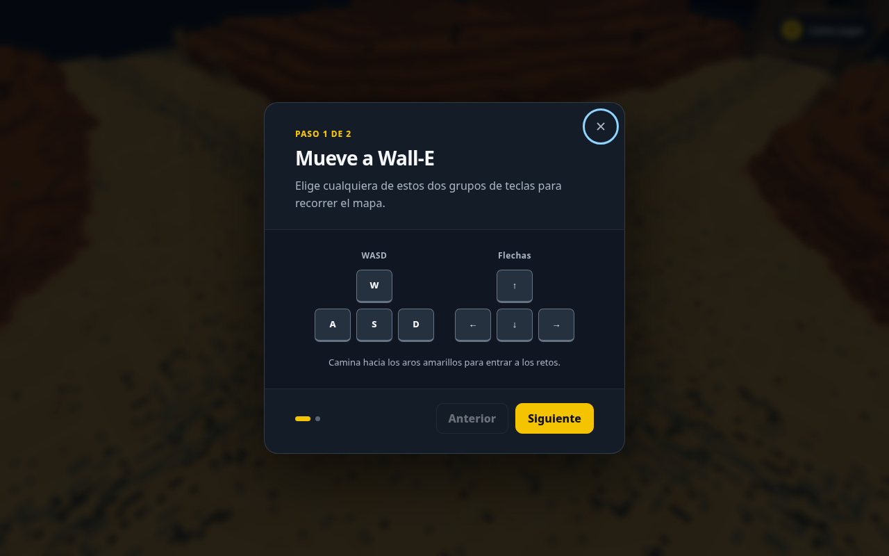
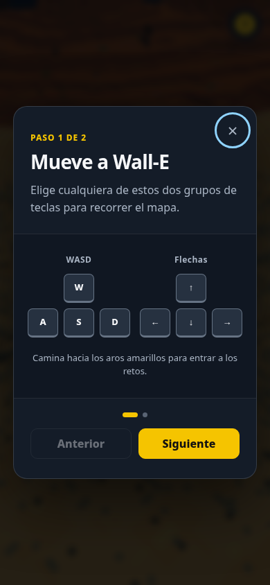
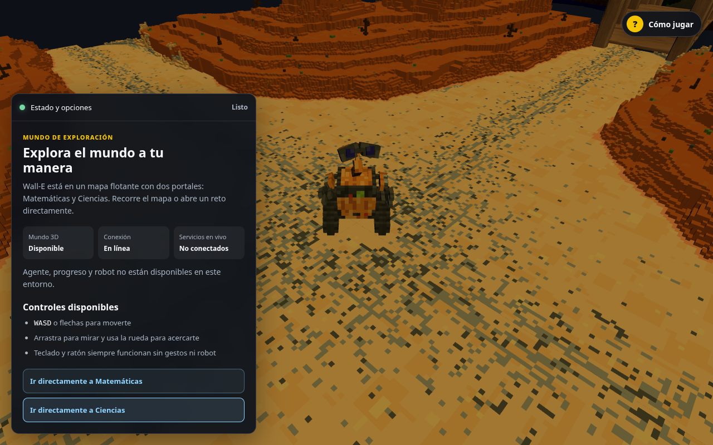
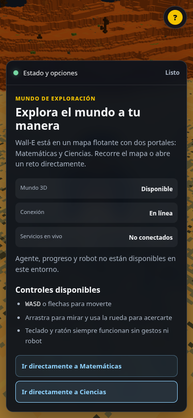
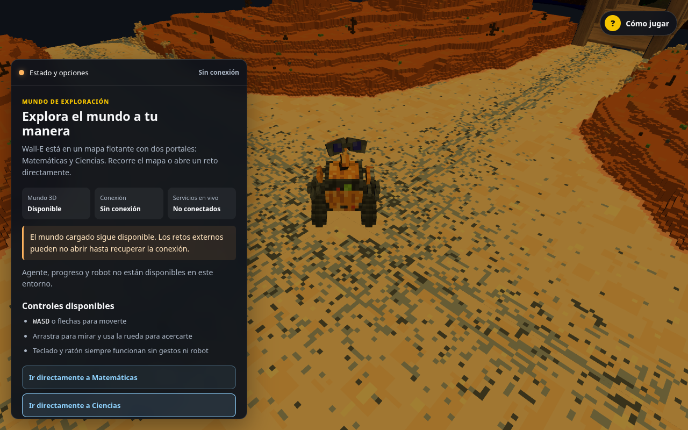
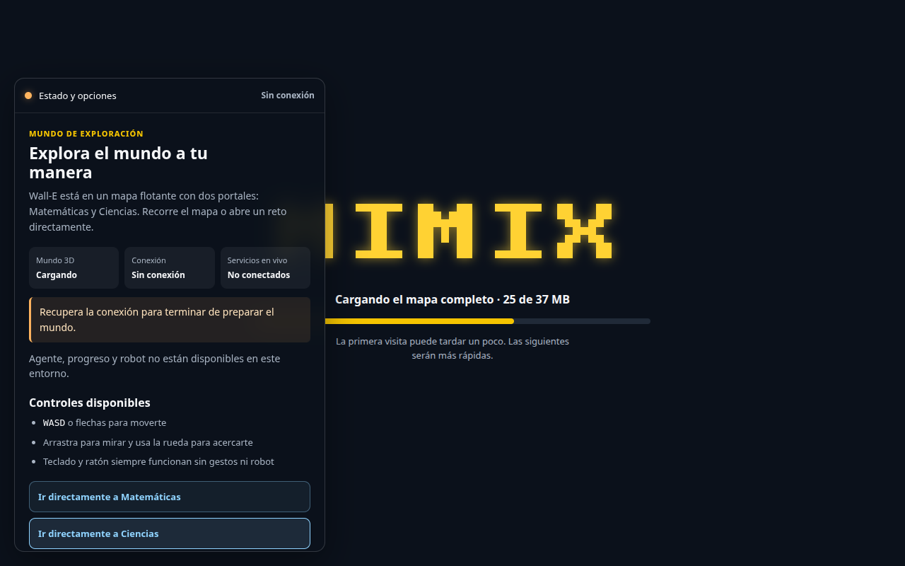
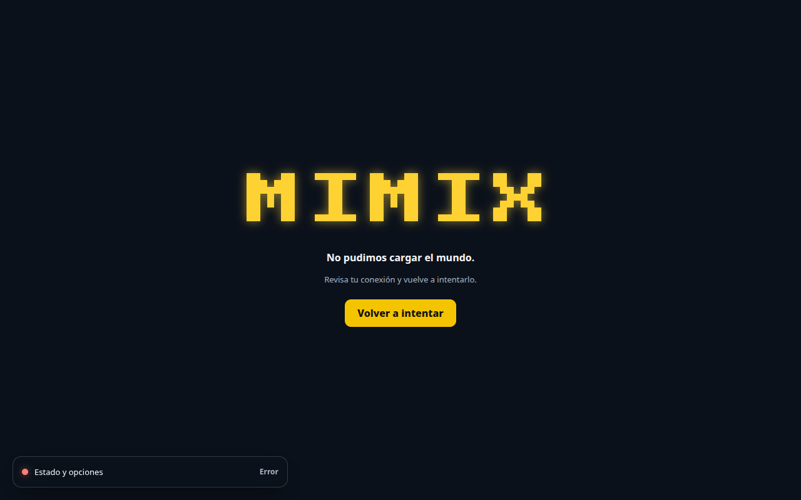

# Evidencia UI accesible de `/play`

Fecha: 2026-10-05. Base: `1c96464c6a29191880f714ac951cc1038c2b4e07`.
Rama: `fix/ui-play-accessible-state-feedback`. Chromium headless con
ANGLE/SwiftShader, Next standalone local y viewports 1280×800 y 390×844.

## Alcance y contratos preservados

La mejora se limita a `/play`: añade feedback accesible para carga, disponibilidad,
offline, error y capacidades no conectadas, más una alternativa textual útil al
canvas. No cambia backend, paquetes de retos, mundo compartido, modelos, shaders,
cámara, robot ni otras superficies.

Se conservaron `#canvas`, `#world-loading`, retry, guía “Cómo jugar”, WASD/flechas,
ratón, navegación de los portales, Shadow DOM y los destinos existentes de
Matemáticas y Ciencias. El panel cerrado no intercepta el resto del mundo.

## Estados

| Estado | Feedback visible | Feedback semántico |
|---|---|---|
| Carga | Progreso existente + indicador ámbar | Región viva “Preparando…” |
| Listo | Indicador verde y “Listo” | “Mundo listo” + controles |
| Offline durante carga | Indicador ámbar; pide recuperar conexión | No afirma que el mundo esté cargado |
| Offline tras carga | Indicador ámbar y aviso de degradación | Anuncio “Sin conexión”; conserva el mundo |
| Servicios desconectados | “No conectados” | Capacidades ausentes nombradas |
| Error de assets | Retry existente + indicador rojo | Alerta asertiva recuperable |

La alternativa desplegable describe el mapa, enumera teclado/ratón y ofrece acceso
directo a ambos retos. No afirma que agente, progreso o robot estén operativos.

## Comparación visual

Antes, el mundo solo exponía su guía visual:





Después, el estado compacto se puede desplegar sin ocultar permanentemente el
mundo; las capturas muestran listo, offline y error:











## Métricas

| Medida | Desktop | Móvil |
|---|---:|---:|
| Panel cerrado | 440×50 px | 366×50 px |
| Panel abierto | 440×612 px | 366×710 px |
| Alto mínimo de controles | 44 px | 44 px |
| Overflow horizontal | No | No |

El JavaScript solicitado por `/play` mide 450.969 bytes gzip calculados. La evidencia
fusionada del PR anterior registró 449,80 kB con el mismo criterio; la diferencia es
1,17 kB (+0,26 %). Los GLB y el runtime Three.js no cambiaron.

## Verificación reproducible

```bash
pnpm install --frozen-lockfile
pnpm --filter @mimix/web build
pnpm --filter @mimix/web test:browser
pnpm check --concurrency=2
```

El test de `/play` bloquea regresiones de estados —incluida pérdida de conexión en
plena carga—, asociación real en el árbol AX de Chromium, destinos, navegación por
teclado, ausencia de overflow y WCAG 2 A/AA/2.1 AA con axe. Las capturas no
certifican GPU física ni disponibilidad de servicios externos.

Resultados de esta rama: instalación congelada correcta; `pnpm check` 58/58 tareas;
Playwright web 11/11 escenarios; axe sin violaciones en los tags indicados; build
Docker limpio y smoke standalone 1/1; `git diff --check` sin errores.
