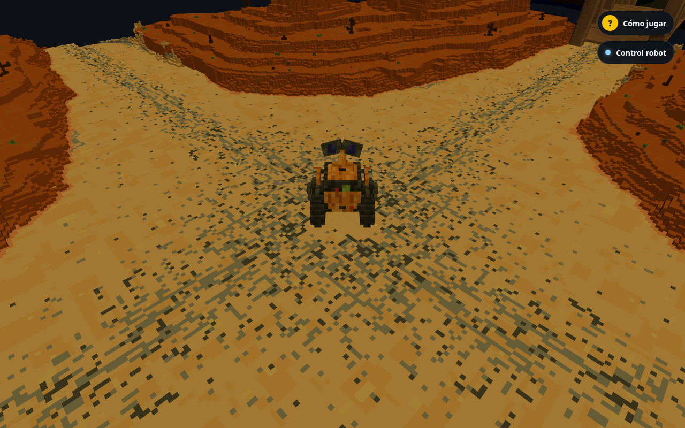
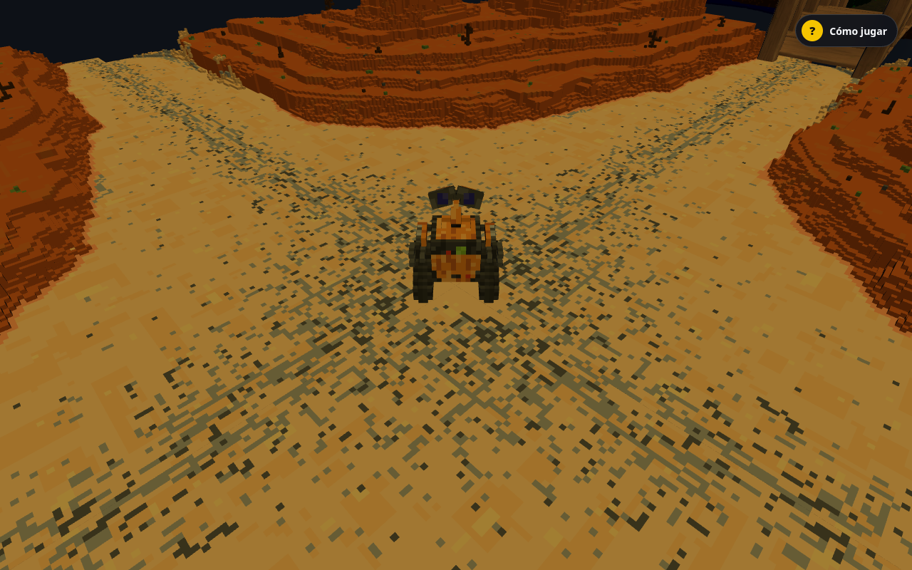

# Evidencia de migración Three.js — prompt 21

Fecha: 2026-10-05, Linux x86_64, Node 22.23.2, pnpm 10.34.6.
Base reconstruida desde `1e2440fa9fade050872eaf8b529bb4ab04d21952` con sus fuentes
originales. Next 16.3.8 standalone y Vite 5.4.21 production, viewport 1280×800.
Render: Chromium 153.0.8010.12 con ANGLE/SwiftShader Vulkan por software.
Cada ejecución abre un contexto limpio de navegador; se hacen tres por host, en
secuencia, sin otras pruebas de navegador del trabajo ejecutándose. Son mediciones
de localhost en una estación compartida, sin throttling ni GPU física.

| Mediana de 3 ejecuciones | Vite base | Vite compartido | Next `/play` |
|---|---:|---:|---:|
| Carga hasta retirar loading (s) | 0.98 | 0.90 | 2.49 |
| FPS (60 intervalos RAF) | 5.11 | 5.11 | 5.29 |
| JS solicitado, gzip calculado (kB) | 168.36 | 203.21 | 449.80 |
| Heap JS retenido tras GC (MB) | 5.37 | 6.20 | 7.87 |
| Backing storage retenido tras GC (MB) | 34.83 | 34.95 | 35.87 |
| GLB decodificado (MB) | 36.35 | 36.35 | 36.35 |
| GLB transferido (MB) | 36.35 | 36.35 | 7.00 |

MB/kB decimales. El dato de heap previo a GC fluctúa por los buffers temporales de
carga, por eso la tabla usa `HeapProfiler.collectGarbage` seguido de
`Runtime.getHeapUsage`. Heap y backing storage no equivalen a RSS del proceso ni
memoria GPU. Las cifras completas por corrida y errores (vacíos) se conservan en
[baseline.json](evidence/threejs/baseline.json), [vite.json](evidence/threejs/vite.json)
y [next.json](evidence/threejs/next.json). Next comprime los GLB en HTTP; el contenido
decodificado y los cinco blobs Git son iguales. No se atribuye esa diferencia a una
reducción de modelos.

El JavaScript del Vite compartido crece un 20,7% gzip respecto a la base por los
contratos y el montaje compartido. Next añade su framework y el chunk de `/play`;
las rutas `/`, `/catalogo` y `/acceso` permanecen en 188.712 bytes gzip, sin Three.js,
GLB, Draco ni sensores. Las mediciones no justifican retirar el frontend anterior;
los gates operativos siguen pendientes según el [runbook](web-threejs-play.md).

## Paridad y recursos

- Los cinco GLB conservan exactamente los blobs de la base; shaders, luces, mapa,
  puentes, velocidad, colisiones, zoom 6–16, WASD/flechas, aros y guía se conservan.
- Navegación por ambas zonas usa manifests instalados. IDs/URLs arbitrarios y
  recomendaciones de versiones no instaladas se rechazan; `vision` solo browser/robot.
- Ciclos repetidos: al desmontar hay cero geometrías/texturas en renderer.info,
  cero workers Draco y RAF detenido; las teclas ya no modifican el input eliminado.
- Salida durante descarga, montaje/limpieza/remontaje estilo StrictMode, ausencia de
  rechazo no manejado, error 503 con retry y restauración BFCache pasan en navegador.
- La UI legacy de motores queda exclusivamente en Vite. Next carece de ese botón;
  la paridad cloud no incluye una integración robot autorizada que aún no existe.
- Puertos SDK probados con Agent Core real y estado/permiso de embodiment de fixture.
  No se afirma una conexión live que no está implementada ni se registra aprendizaje
  ficticio durante exploración.

Capturas inspeccionadas del mismo punto inicial (la pose idle puede variar):





## Validaciones ejecutadas

| Gate | Resultado |
|---|---|
| `pnpm install --frozen-lockfile` | Correcto local y en Docker limpio |
| `pnpm check --concurrency=2` | 58 tareas, 241 pruebas, cero fallos |
| Build Turbo Next + Vite y dependencias | 13 tareas correctas |
| Tests de contratos/lifecycle de world | 8 correctos, incluidos en check |
| Playwright Vite | 60 correctos: Chromium, Firefox, WebKit |
| Playwright Next | 8 correctos: SSR, mundo, retry, BFCache y shell |
| Contrato web contra Nest/PostgreSQL real | Correcto, paginación y aislamiento |
| Build `apps/web/Dockerfile` | Correcto; imagen `mimix-web:ci` |
| Smoke contenedor standalone | Correcto: rutas, chunks, cinco GLB por SHA-256, Draco, salud y usuario no root |
| Revisión independiente final | Sin hallazgos importantes pendientes |
| `git diff --check` y lint final | Correctos |

WebKit local se ejecutó con `PLAYWRIGHT_BROWSERS_PATH=/tmp/mimix-migration-browser-libs`,
un runtime ya existente con libevent compatible. El runtime predeterminado no arrancó
por una biblioteca ausente en Ubuntu 26.04; no fue un fallo de aplicación. Una corrida
intermedia de Chromium coincidió con HMR durante una edición; la corrida final
completa, sin cambios simultáneos, aprobó las 60 pruebas. Los errores de proxy hacia
sensores sin API local corresponden a los casos explícitos de degradación probados.
ARM64/hardware robot, GPU real y OAuth Google externo no se certifican con estos checks.

## Reproducir mediciones

Reconstruir el cliente de la base con `git archive 1e2440f client` en un directorio
temporal y resolver sus dependencias con el mismo lockfile/instalación. Construir
la rama actual con Turbo. Servir ambos `dist` por HTTP local sin compresión y Next
con `pnpm --filter @mimix/web start`; usar puertos separados. Después:

```bash
node client/scripts/measure-world.mjs http://127.0.0.1:8765 /tmp/baseline.json
node client/scripts/measure-world.mjs http://127.0.0.1:8766 /tmp/vite.json
node client/scripts/measure-world.mjs http://127.0.0.1:3101/play /tmp/next.json
```

El script conserva JSON y una captura por host; recoge tres contextos nuevos,
60 intervalos RAF (descartando el primer timestamp), recursos JS/GLB y memoria
retenida tras GC. `--memory-only` omite la captura y el muestreo de FPS.
